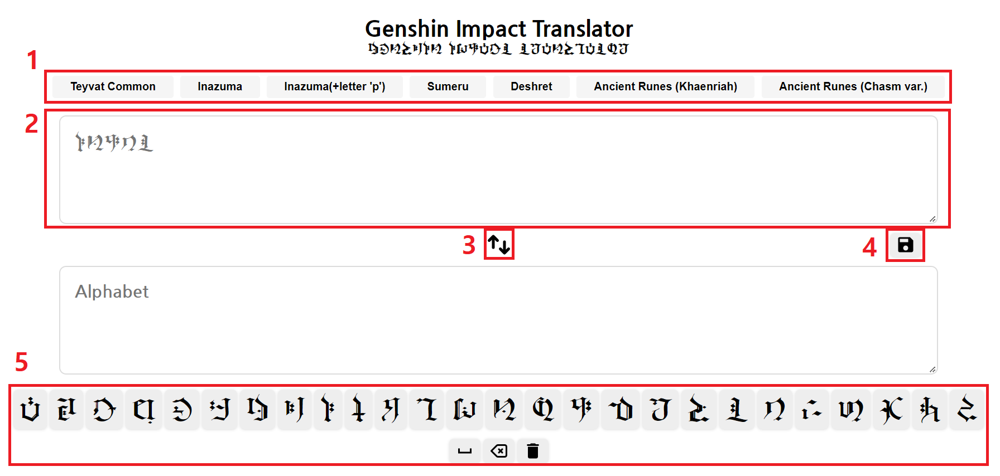

# How to use

1. 번역하고 싶은 언어를 선택합니다.
2. 아래의 문자(5번 영역)를 클릭해 번역할 내용을 입력합니다. 텍스트칸 안에 직접 입력도 가능합니다.
3. 가운데의 스위치 화살표를 눌러 텍스트칸의 순서를 변경할 수 있습니다.
4. 입력한 내용을 이미지 파일(PNG)로 다운로드 받을 수 있습니다. 티바트 문자로 입력한 부분(2번 영역)만 다운로드할 수 있으며, 텍스트칸 우하단을 클릭해 크기를 조정할 수 있습니다(자동 크기조절 준비중).